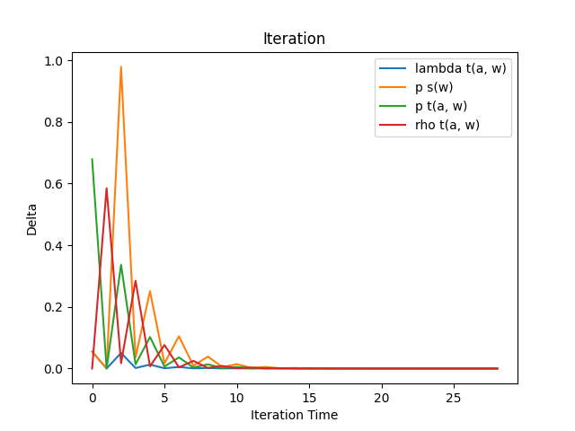

# Ridepooling-Matching-Prediction-on-Real-Network

Programs in this repository are aimed to parallelly implement the mathematical model in the paper [https://doi.org/10.1016/j.trb.2021.10.005](https://doi.org/10.1016/j.trb.2021.10.005) on a real network. Part of files are copied from my private repository. The codes can be download from [https://github.com/Feng-Yz/Ridepooling-Matching-Prediction-on-Real-Network](https://github.com/Feng-Yz/Ridepooling-Matching-Prediction-on-Real-Network). If you have any question, you can open issues on GitHub or send emails to [fyz020301@outlook.com](mailto:fyz020301@outlook.com).

## Requirements

```
osm2gmns=0.5.5
networkx=2.6.3
pandas=1.4.2
numpy=1.21.2
progress=1.6
matplotlib=3.5.1
```

## An Example

The example data has been included in the repository.

### Step 0: Set the parameters in `settings.py`

For example,
```python
params = {
    'lowest_road_class': 5,
    'OD_num': 500,
    'process_num': 4,
    'chunk_num': 5,
    'search_radius': 2000,
    'max_detour': 3000,
    'w_detour': -0.5,
    'w_pickup': -0.3,
    'w_shared': 0.2,
    'pickup_time': 2,
    'speed': 600, # m/min
    'max_iter_time': 200,
    'convergent_condition': 1e-6,
    'M': 1e6,
}
```

### Step 1: Put your network data in the filefolder `primitive/`

#### Step 1.a: If you data is an `osm` file, execute `transform_osm_to_csv.py`

```shell
> python.exe .\transform_osm_to_csv.py
```

#### Step 1.b: If you want to simplify the network, execute `preprocess_primitive_csv.py`

```shell
> python.exe .\preprocess_primitive_csv.py
Graph with 7399 nodes and 9441 links.
Select maximum subgraph from connected component with [7384, 7, 4, 2, 2] nodes.
Simplified graph with 3373 nodes and 5400 links.
Graph connectivity: True
```

### Step 2: Put your OD data in the filefolder `data/`

### Step 3: Generate the pickle files for the network and OD data

```shell
> python.exe .\generate_pickle.py
Loading node.csv |################################| 100%
Loading link.csv |################################| 100%
Loading OD.csv |################################| 100%
```

### Step 4: Parallelly calculate the shortest paths and generate the ego graphs

```shell
> python.exe .\parallel_shortest_path_and_ego_graph.py
Start calculating shortest paths:
Finish calculating shortest paths: 3.3029918670654297
Start generating ego graphs:
Finish generating ego graphs: 0.4730062484741211
```

### Step 5: Parallelly search the matching pairs

```shell
> python.exe .\parallel_searching_of_matching_pairs.py
Start searching matching pairs:
Finish seaching matching pairs: 21.831998348236084
```

### Step 6: Do the fixed point iterations and make prediction

```shell
python.exe .\predict.py
Data loaded.
Variables initialized.
Iterating... |01234567890123456789012345678
Converge! It costs: 11.640002489089966
The average time of iteration: 0.40137939617551605
Result saving ...
```



### Step 7: Check the result in `result/predict_result.csv`

```shell
OD_id	matching_prob	ride_distance	detour_distance	shared_distance
0	    0.911224669	    6824.378772	    835.0921388	    3439.77694
1	    0.773873834	    4069.632956	    254.2881693	    1775.616014
2	    0.903171777	    29821.68216	    915.6722961	    12045.32647
3	    0.876146915	    23003.26472	    523.0981483	    12606.01919
4	    0.595931399	    30810.04306	    873.089542	    6707.012484
5	    0.989720178	    18882.83012	    828.3010821	    9015.150311
6	    0.647300452	    2584.640656	    410.7465164	    1285.908889
...
```

## Functions of each `.py` file

### `settings.py`

It contains all the parameters. That is
- `lowest_road_class`: This parameter will be explained below
- `OD_num`: The number of origin and destination pairs used
- `process_num`: The number of processes to be used
- `chunk_num`: The number of chunks you want to assign to a process on average
- `search_radius`: $\overline{R}$
- `max_detour`: $\overline{D}$
- `w_detour`: The weight of detour distance (usually negative)
- `w_pickup`: The weight of pickup distance (usually negative)
- `w_shared`: The weight of shared distance (usually positive)
- `pickup_time`: The pickup time for a new taker
- `speed`: The speed of vechicles in meters per minute
- `max_iter_time`: Maximum iteration times of the fixed point iteration
- `convergent_condition`: The absolute condition of the convergence of the iteration
- `M`: A sufficiently large number (rarely used)

### `transform_osm_to_csv.py`

It will turn an osm file into two csv files storing the nodes and links of the road network respectively. When dealing with the topological relationships of the road network in the osm file, it will consolidate complex intersections, as shown in osm2gmns' [docs](https://osm2gmns.readthedocs.io/en/latest/quick-start.html#consolidate-intersections).

- Input: `primitive/data.osm`
- Output: `primitive/node.csv` and `primitive/link.csv`

The osm file can be directly download from OpenStreetMap. The columns of `node.csv` are mainly `node_id` (ID), `x_coord` (longitude) and `y_coord` (latitude), and those of `link.csv` are mainly `link_id` (ID), `from_node_id` (the ID of its begin node), `to_node_id` (the ID of its end node), `length` and `link_type` (the type of the link). Others are insignificant in our programs.

### `preprocess_primitive_csv.py`

It has three functions.

First, it filters a subgraph containing (mainly) links belonging to a higher class than the parameter `lowest_road_class`:
- All nodes constructing these links are included.
- All links from AND to the above nodes are included.

Second, it checks the connectivity of the subgraph and choose the largest connected component. For convenience, we view the road network as undirected.

Third, it will combine some nodes with only 2 degrees. Though it has a risk to cause the fixed point iteration unable to convergent, the probability is thought to be very small if the parameters are set suitable.

- Input: `primitive/node.csv` and `primitive/link.csv`
- Output: `data/node.csv` and `data/link.csv`

The structures of the 2 output csv files are the same as the input ones.

### `generate_pickle.py`

It will turn the data of nodes and links into a `networkx.Graph` and store it as well as information of nodes, links and origin-destination pairs into binary files.

- Input: `data/node.csv`, `data/link.csv` and `data/OD.csv`
- Output: `tmp/node.pickle`, `tmp/link.pickle`, `tmp/OD.pickle` and `tmp/graph.pickle`

The columns of `OD.csv` are `OD_id` (ID), `origin_id` (the ID of its origin), `destination_id` (the ID of its destination), `lambda` (the mean arrival rate of orders). When you load the four pickle files, `graph.pickle` will recover as a `networkx.Graph`, the other three will become a `dict` in Python. The keys are their respective ID. The values are all `list`s containing:
- `node.pickle`: `x_coord` (longitude), `y_coord` (latitude)
- `link.pickle`: `from_node_id` (the ID of its begin node), `to_node_id` (the ID of its end node), `length`
- `OD.pickle`: `origin_id` (the ID of its origin), `destination_id` (the ID of its destination), `lambda` (the mean arrival rate of orders)

### `parallel_shortest_path_and_ego_graph.py`

It will parallelly calculate the Dijkstra shortest path and generate the ego graph (which is the subgraph centered at the origin within a given distance) for each given pair of origin and destination.

- Input: `tmp/OD.pickle` and `tmp/graph.pickle`
- Output: `tmp/shortest_path.pickle` and `tmp/ego_graph.pickle`

The `shortest_path.pickle` will become a `dict`. Its keys are `OD_id`, and values are a list of `link_id` of links constructing the Dijkstra path of the OD. **Note that there is a number recording the shortest distance appended at the end of the list.** The `ego_graph.pickle` will also become a `dict` after recovering, also with `OD_id` being the keys, and with a ego graph `networkx.Graph` being the values.

### `parallel_searching_of_matching_pairs.py`

It will parallelly search matching pairs of seeker- and taker- states, which checks the two matching conditions.

- Input: `tmp/link.pickle`, `tmp/OD.pickle`, `tmp/graph.pickle`, `tmp/shortest_path.pickle` and `tmp/ego_graph.pickle`
- Output: `result/match.csv`

The output is a csv file with columns of `seeker_id` (the ID of seeker's OD), `taker_id` (the ID of taker's OD), `link_idx` (the index of the link constructing the Dijkstra path of the taker's OD), `preference`, `ride_seeker` (the ride distance of the seeker), `ride_taker` (the ride distance of the taker), `detour_seeker` (the detour distance of the seeker), `detour_taker` (the detour distance of the taker) and `shared` (the shared distance of the match).

### `predict.py`

It will execute the fix point iteration and make use of the solution to do the prediction.

- Input: `tmp/link.pickle`, `tmp/OD.pickle`, `tmp/shortest_path.pickle` and `result/match.csv`
- Output: `result/predict_result.csv`, `result/iteration.png`, `variables/seekers.pickle`, `variables/takers.pickle`, `variables/matches.pickle`

The columns of `predict_result.csv` include `matching_prob` (matching probability), `ride_distance`, `detour_distance` and `shared_distance`. The `iteration.png` is a line plot showing the convergence of the iterations. The other three pickle files will turn into a `dict` after loading, the keys are the ID of all OD pairs and the values are:
- `seekers.pickle`: a `dict` with keys of `"lambda"` (the mean arrival rate), `"p_seeker"` ($p_{s(w)}$)
- `takers.pickle`: a `dict` of taker-states belonging to the OD with keys of the indices of links. The values are also a `dict` with keys of `"tau_bar"`($\bar{\tau}$), `"lambda_taker"` ($\lambda_{t(a, w)}$), `"p_taker"` ($p_{t(a, w)}$), `"rho_taker"` ($\rho_{t(a, w)}$), `"eta_taker"` ($\eta_{t(a, w)}$)
- `matches.pickle`: a `list`, in which each element is a `dict` storing the information of a match of a taker-state with the seeker-state of the OD, The `dict` contains `"taker_id"` (the ID of taker's OD), `"link_idx"` (the index of the link constructing the Dijkstra path of the taker's OD), `"preference"`, `"ride_seeker"` (the ride distance of the seeker), `"ride_taker"` (the ride distance of the taker), `"detour_seeker"` (the detour distance of the seeker), `"detour_taker"` (the detour distance of the taker), `"shared"` (the shared distance of the match) and `"eta_match"` ($\eta_{t(a, \omega)}^{s(w)}$)
